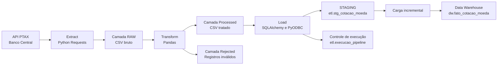

# Pipeline ETL de Cotações PTAX

[](https://github.com/natansales221/EngenhariaDeDados/actions/workflows/tests.yml)

Pipeline de Engenharia de Dados desenvolvido em Python para extrair cotações de moedas da API pública PTAX do Banco Central do Brasil, transformar e validar os dados e carregá-los de forma incremental em um banco SQL Server.

O projeto foi estruturado para demonstrar conceitos de Engenharia de Dados como ingestão via API, camadas de dados, qualidade, staging, carga incremental, idempotência, controle de execuções e testes automatizados.

---

## Objetivo

Construir um pipeline ETL completo que:

1. Consulte uma API pública.
2. Armazene os dados brutos em CSV.
3. Transforme e valide os registros.
4. Separe dados inválidos ou duplicados.
5. Carregue os dados em uma área de staging.
6. Insira ou atualize os registros no Data Warehouse.
7. Registre o histórico das execuções.
8. Permita reprocessamento sem duplicar dados.

---

## Arquitetura



---

## Fluxo do pipeline

```text
API PTAX
   ↓
Extração em Python
   ↓
CSV bruto na camada RAW
   ↓
Transformação e validação com Pandas
   ↓
CSV processado ou rejeitado
   ↓
Carga na tabela de staging
   ↓
Atualização e inserção incremental
   ↓
Tabela final no Data Warehouse
```

---

## Tecnologias utilizadas

- Python 3.13
- Pandas
- Requests
- SQLAlchemy
- PyODBC
- SQL Server LocalDB
- Tenacity
- Python Dotenv
- Pytest
- Git e GitHub

---

## Principais conceitos aplicados

### Extração via API

A etapa de extração consulta a API PTAX por moeda e período.

As moedas configuradas inicialmente são:

- USD — Dólar americano
- EUR — Euro
- GBP — Libra esterlina

A extração possui:

- timeout configurável;
- novas tentativas em falhas temporárias;
- tratamento de erros HTTP;
- parametrização de período;
- parametrização de moedas;
- geração de metadados técnicos.

---

### Camada RAW

Os dados recebidos da API são armazenados em CSV antes de qualquer transformação.

Exemplo:

```text
data/raw/2026/07/20/ptax_raw_20260713_20260717_20260720_103836.csv
```

Essa camada preserva os dados originalmente recebidos, permitindo auditoria e reprocessamento.

---

### Transformação e qualidade

A etapa de transformação realiza:

- padronização dos nomes das colunas;
- conversão dos tipos numéricos;
- conversão de datas;
- padronização dos códigos das moedas;
- validação de campos obrigatórios;
- identificação de valores inválidos;
- identificação de valores negativos;
- remoção de duplicidades;
- criação da data de referência;
- inclusão do arquivo de origem.

Os dados válidos são gravados em:

```text
data/processed/
```

Os registros inválidos ou duplicados são gravados em:

```text
data/rejected/
```

---

### Chave de negócio

A identificação única de uma cotação é feita por:

```text
moeda
+ data_hora_cotacao
+ tipo_boletim
```

Essa chave é utilizada para impedir duplicidades na tabela final.

---

### Carga incremental

Os dados processados são carregados primeiro na tabela:

```text
etl.stg_cotacao_moeda
```

Depois, uma stored procedure executa:

1. Atualização dos registros alterados.
2. Inserção dos registros novos.
3. Limpeza dos dados da staging.
4. Retorno das métricas da carga.

A tabela final é:

```text
dw.fato_cotacao_moeda
```

---

### Idempotência

O pipeline pode ser executado novamente para o mesmo período sem duplicar registros.

Na primeira execução:

```text
Registros inseridos: 75
Registros atualizados: 0
```

Na reexecução do mesmo arquivo:

```text
Registros inseridos: 0
Registros atualizados: 0
```

Essa característica permite reprocessar períodos com segurança.

---

### Controle das execuções

Cada carga gera um registro em:

```text
etl.execucao_pipeline
```

São armazenadas informações como:

- identificador da execução;
- data e hora de início;
- data e hora de término;
- status;
- período processado;
- quantidade extraída;
- quantidade transformada;
- quantidade rejeitada;
- quantidade inserida;
- quantidade atualizada;
- arquivo de origem;
- mensagem de erro.

Status possíveis:

```text
INICIADO
SUCESSO
ERRO
```

---

## Estrutura do projeto

```text
EngenhariaDeDados/
│
├── config/
│   ├── __init__.py
│   └── settings.py
│
├── data/
│   ├── raw/
│   ├── processed/
│   └── rejected/
│
├── logs/
│
├── sql/
│   ├── 01_create_database.sql
│   ├── 02_create_schemas.sql
│   ├── 03_create_tables.sql
│   └── 04_merge_cotacoes.sql
│
├── src/
│   ├── __init__.py
│   ├── database.py
│   ├── setup_database.py
│   ├── extract.py
│   ├── transform.py
│   ├── load.py
│   └── pipeline.py
│
├── tests/
│   ├── __init__.py
│   ├── test_extract.py
│   └── test_transform.py
│
├── .env.example
├── .gitignore
├── requirements.txt
└── README.md
```

---

## Objetos criados no SQL Server

### Schemas

```text
etl
dw
```

### Tabelas

```text
etl.execucao_pipeline
etl.stg_cotacao_moeda
dw.fato_cotacao_moeda
```

### Stored procedure

```text
etl.usp_carregar_cotacao_moeda
```

---

## Configuração do ambiente

### 1. Clonar o repositório

```powershell
git clone https://github.com/natansales221/EngenhariaDeDados.git
cd EngenhariaDeDados
```

### 2. Instalar as dependências

O ambiente virtual não é versionado. As dependências necessárias estão declaradas no arquivo `requirements.txt`.

```powershell
py -m pip install --user -r requirements.txt
```

### 3. Criar o arquivo de configuração

Copie o arquivo de exemplo:

```powershell
Copy-Item .env.example .env
```

Exemplo para SQL Server LocalDB:

```env
API_BASE_URL=https://olinda.bcb.gov.br/olinda/servico/PTAX/versao/v1/odata
CURRENCIES=USD,EUR,GBP

API_TIMEOUT_SECONDS=30
API_MAX_ATTEMPTS=3

DB_SERVER=(localdb)\MSSQLLocalDB
DB_DATABASE=EngenhariaDeDados
DB_DRIVER=ODBC Driver 17 for SQL Server
DB_AUTH=windows

DB_USERNAME=
DB_PASSWORD=

DB_TRUST_SERVER_CERTIFICATE=yes
```

O arquivo `.env` contém configurações locais e não é enviado ao GitHub.

---

## Preparar o banco de dados

Inicie o SQL Server LocalDB:

```powershell
sqllocaldb start MSSQLLocalDB
```

Execute os scripts de criação dos schemas, tabelas e stored procedure:

```powershell
py -m src.setup_database
```

Resultado esperado:

```text
Estrutura do banco criada com sucesso.

Tabelas encontradas:
  - dw.fato_cotacao_moeda
  - etl.execucao_pipeline
  - etl.stg_cotacao_moeda
```

---

## Executar o pipeline completo

```powershell
py -m src.pipeline --start-date 2026-07-06 --end-date 2026-07-10
```

Também é possível informar moedas específicas:

```powershell
py -m src.pipeline `
    --start-date 2026-07-06 `
    --end-date 2026-07-10 `
    --currencies USD EUR
```

O pipeline executará:

```text
[1/3] Extração
[2/3] Transformação
[3/3] Carga
```

---

## Executar cada etapa separadamente

### Extração

```powershell
py -m src.extract `
    --start-date 2026-07-06 `
    --end-date 2026-07-10
```

### Transformação

```powershell
py -m src.transform
```

### Carga

```powershell
py -m src.load
```

---

## Testes automatizados

Execute:

```powershell
py -m pytest -v
```

Resultado atual:

```text
15 passed
```

Os testes verificam:

- formatação das datas da API;
- validação do período;
- tratamento da resposta da API;
- geração do CSV RAW;
- validação do schema;
- conversão dos campos numéricos;
- identificação de registros inválidos;
- tratamento de valores negativos;
- deduplicação;
- geração dos arquivos processados e rejeitados.

As requisições da API são simuladas nos testes, evitando dependência de serviços externos.

---

## Segurança

O projeto não versiona:

- senhas;
- credenciais;
- arquivos `.env`;
- CSVs extraídos;
- CSVs processados;
- registros rejeitados;
- dados locais do SQL Server.

As configurações públicas estão disponíveis somente em:

```text
.env.example
```

---

## Melhorias futuras

- Dockerização da aplicação e do banco.
- Orquestração com Apache Airflow.
- Persistência da camada RAW em armazenamento de objetos.
- Monitoramento e alertas.
- Logging estruturado.
- Pipeline de CI/CD com GitHub Actions.
- Testes automatizados da etapa de carga.
- Execução agendada.
- Dashboard em Power BI.
- Migração para infraestrutura em nuvem.

---

## Autor

Natan Sales

Projeto desenvolvido como parte do portfólio de Engenharia de Dados.
